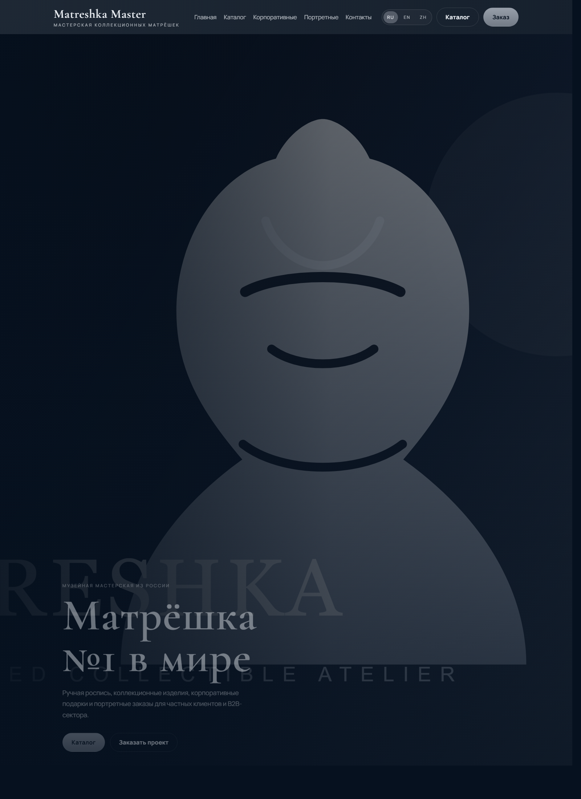
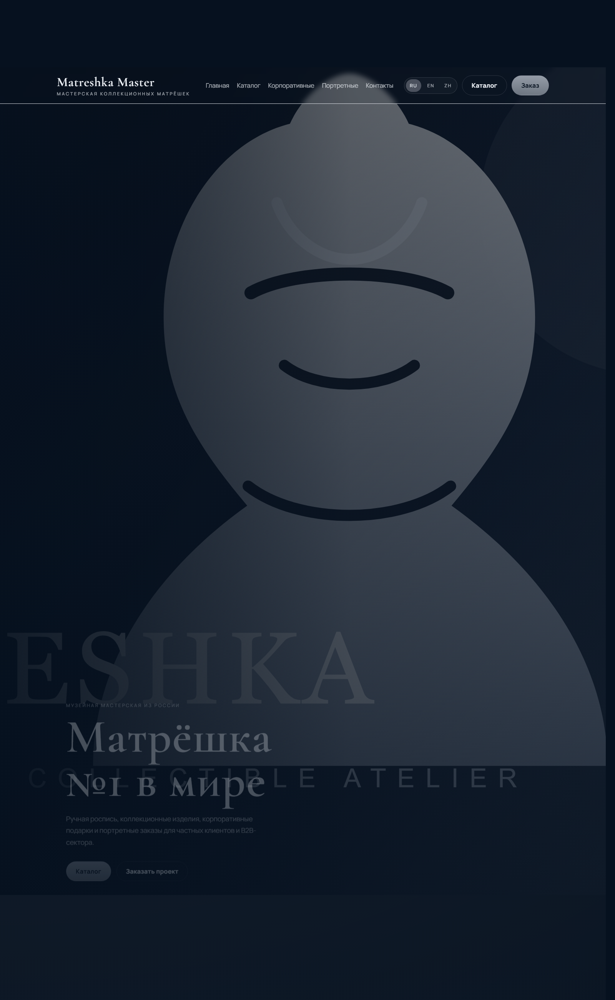
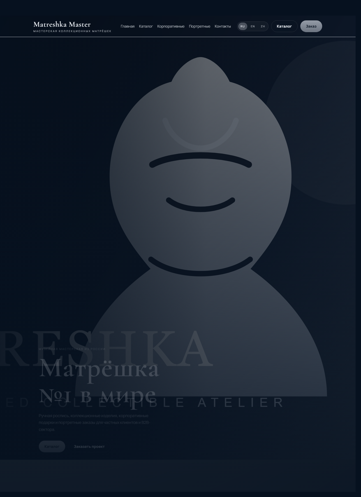

<div align="center">

# Matreshka Master
### Premium WordPress / WooCommerce catalog for a collectible artisan brand

Custom WordPress project for a premium matryoshka workshop: multilingual-ready architecture, WooCommerce catalog, editable homepage sections, lead forms, and a clean admin workflow for content management.

---

[](#)
[](#)
[](#)
[](http://localhost:8080)

</div>

---

## Project Gallery

### Hero


### Showcase Sections


### FAQ


### WooCommerce Shop


---

## What This Project Is

This repository contains a custom WordPress build for the brand "Matreshka Master":

- custom theme: `wp-content/themes/matreshka-master`
- custom project plugin: `wp-content/plugins/matreshka-master-core`
- WooCommerce-based product catalog architecture
- multilingual-ready structure for Russian / English / Chinese
- editable homepage sections through WordPress admin
- showcase carousels, FAQ, contact blocks, and lead forms
- local Docker setup for fast bootstrapping

---

## Initial Technical Brief

The original task required:

- premium adaptive website for the company "Matreshka Master"
- positioning as a premium global-level handcrafted brand
- WordPress CMS with manageable admin area
- WooCommerce catalog and future-ready payment architecture
- multilingual support: `RU / EN / ZH`
- premium minimalist UI with quiet luxury direction
- homepage with:
  - hero section
  - printed matryoshka showcase
  - B2B gifts showcase
  - portrait matryoshka showcase
  - elite / VIP orders block
  - workshop story block
  - FAQ
  - footer with contacts and legal links
- lead capture forms for:
  - project order
  - price by photo
  - corporate proposal
  - personal manager
- SEO-friendly structure
- editable content zones
- clean maintainable codebase and deployment / support documentation

---

## What Was Implemented

### Frontend

- premium homepage with dark luxury visual direction
- hero section with editable eyebrow, title, text, CTA, poster, and video URL
- three showcase sections:
  - prints
  - corporate gifts
  - portrait matryoshkas
- adaptive carousels with front/back and before/after switching
- elite orders section
- workshop story and stats section
- FAQ accordion
- contact / lead capture section
- responsive header, menu, CTA buttons, and modal behavior

### WordPress Theme

- custom WordPress theme with reusable template structure
- helper layer for options, localized strings, and schema pieces
- WooCommerce styling layer
- semantic structure and SEO-ready markup foundation

### WordPress Plugin

- custom post types:
  - `mm_showcase`
  - `mm_faq`
  - `mm_lead`
- homepage admin metaboxes
- global project settings page
- lead form processing and storage in admin
- webhook / Telegram integration points
- demo content seeding for local setup

### Admin Experience

- editable homepage content from page metaboxes
- editable showcase cards through a dedicated admin section
- editable FAQ through a dedicated admin section
- WooCommerce product management through native `Products`
- centralized project settings via `Matreshka Master`

### DevOps / Setup

- local Docker stack for WordPress + MySQL
- bootstrap script for local deployment
- project docs for setup and editing workflow

---

## What Is Completed vs. What Is Still Production-Dependent

### Completed

- custom WordPress architecture
- custom theme and core plugin
- homepage structure from the brief
- WooCommerce catalog foundation
- editable admin areas
- responsive frontend
- lead forms and lead storage
- multilingual-ready structure
- local launch documentation

### Requires Final Client Materials / Access

- real photo and video content
- final RU / EN / ZH copy
- legal pages and business details
- SMTP credentials
- payment gateway credentials
- Bitrix / Telegram / WhatsApp / MAX integration credentials

### Important Limitation

Full multilingual WooCommerce catalog behavior requires one of these production solutions:

- `Polylang for WooCommerce`
- `WPML + WooCommerce Multilingual`

The current build already supports multilingual page architecture, but the full multilingual product catalog flow depends on the final WooCommerce multilingual add-on choice.

---

## Tech Stack

| Layer | Stack |
|------|------|
| CMS | WordPress |
| Catalog | WooCommerce |
| Multilingual Architecture | Polylang-ready / WPML-ready |
| Theme | Custom PHP theme |
| Plugin Layer | Custom project plugin |
| Frontend | HTML, CSS, vanilla JavaScript |
| Local Environment | Docker, MySQL, WordPress CLI |
| SEO Layer | Rank Math-ready foundation |

---

## Repository Structure

```text
.
├── docker-compose.yml
├── README.md
├── docs/
│   ├── architecture.md
│   ├── content-editing.md
│   ├── deployment.md
│   ├── plugin-inventory.md
│   └── screenshots/
├── scripts/
│   ├── bootstrap.ps1
│   └── seed-demo.php
└── wp-content/
    ├── plugins/
    │   └── matreshka-master-core/
    └── themes/
        └── matreshka-master/
```

---

## Local Launch

### Requirements

- Docker Desktop
- Windows PowerShell

### Start

```powershell
powershell -ExecutionPolicy Bypass -File .\scripts\bootstrap.ps1
```

### URLs

- frontend: [http://localhost:8080](http://localhost:8080)
- admin: [http://localhost:8080/wp-admin](http://localhost:8080/wp-admin)

### Default Local Credentials

- login: `admin`
- password: `admin`

---

## What The Bootstrap Script Does

- starts MySQL and WordPress containers
- waits for database readiness
- installs WordPress locally
- activates the custom theme
- activates the project plugin
- installs and activates:
  - WooCommerce
  - Polylang
  - Rank Math SEO
  - WP Mail SMTP
- seeds demo homepage content, showcases, FAQ, and sample products

---

## Admin Editing Flow

### Homepage

- open the static homepage in `Pages`
- edit metaboxes for:
  - Hero
  - Sections
  - Elite
  - Workshop
  - Contact block

### Showcases

- open `Витрины`
- manage cards for:
  - prints
  - corporate
  - portrait

### FAQ

- open `FAQ`
- each entry is one question / answer item

### Catalog

- open `Products`
- manage categories, prices, gallery, descriptions, and stock fields via WooCommerce

### Global Settings

- open `Matreshka Master`
- edit contacts, social links, legal URLs, messages, and integration endpoints

---

## Notes

- This project was built as a reusable premium WordPress catalog foundation.
- The repository contains the codebase and local setup, not a production deployment.
- The current visual content includes demo placeholders and seeded sample data for presentation and дальнейшей адаптации.

