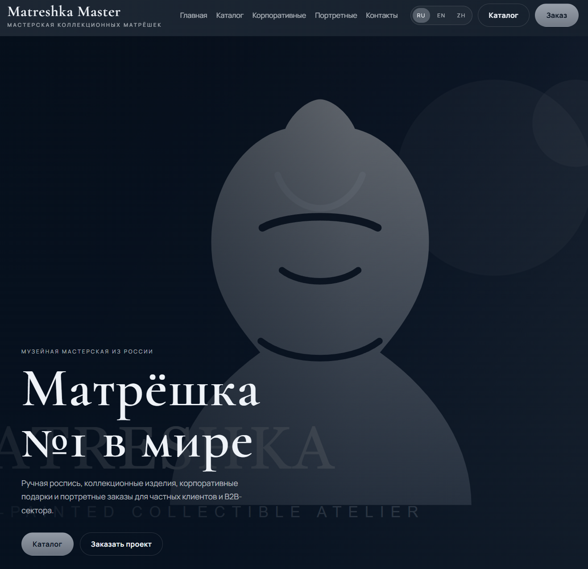
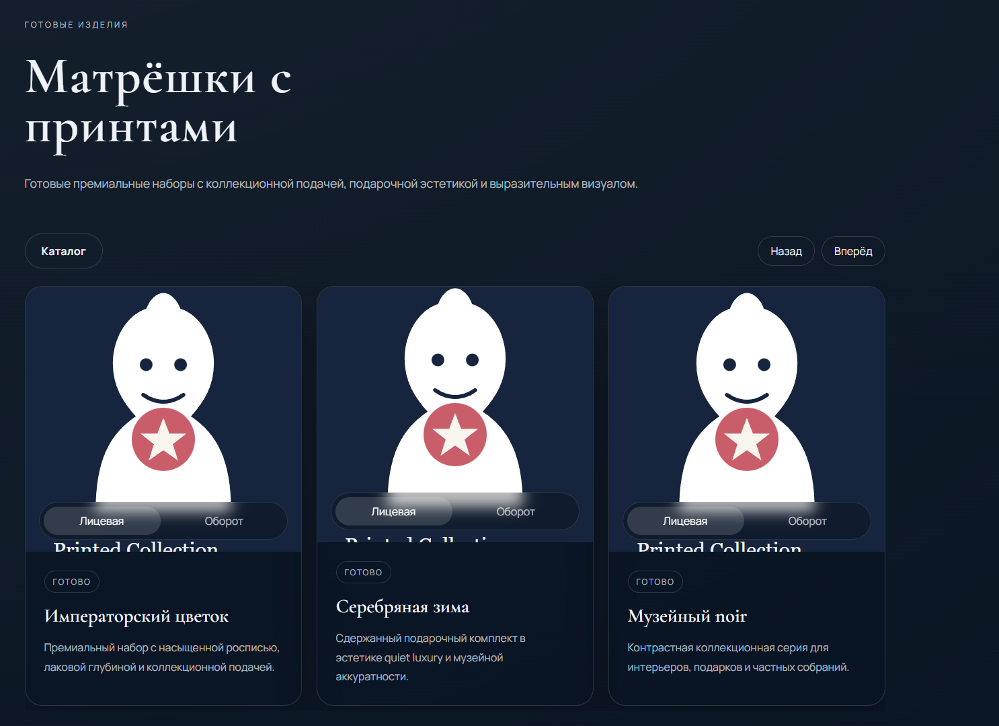
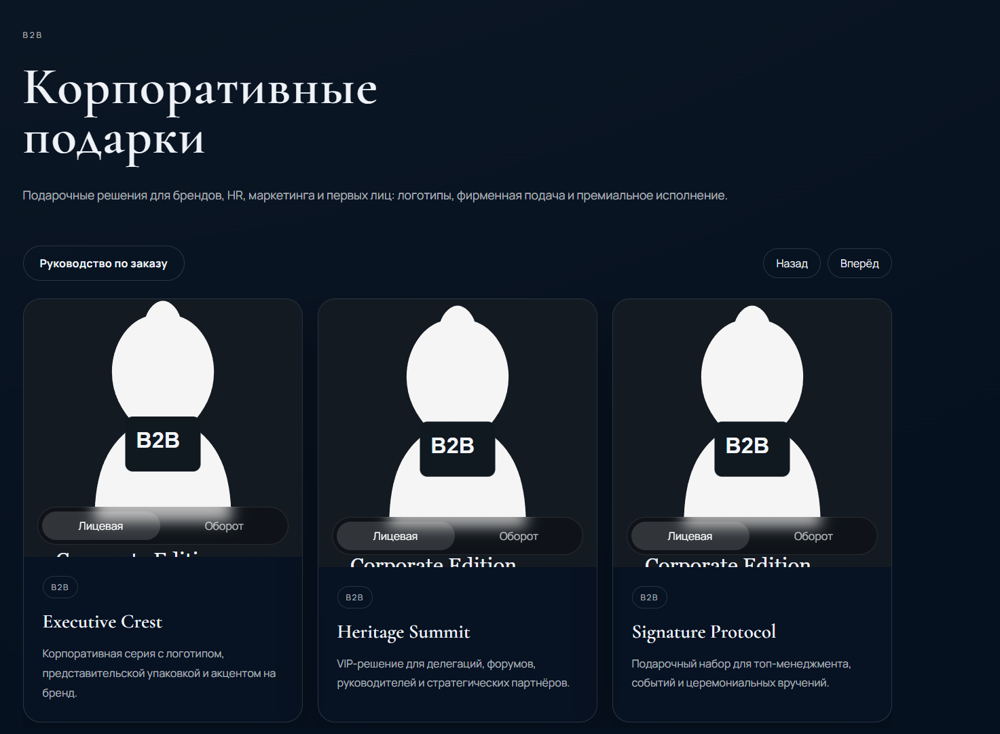
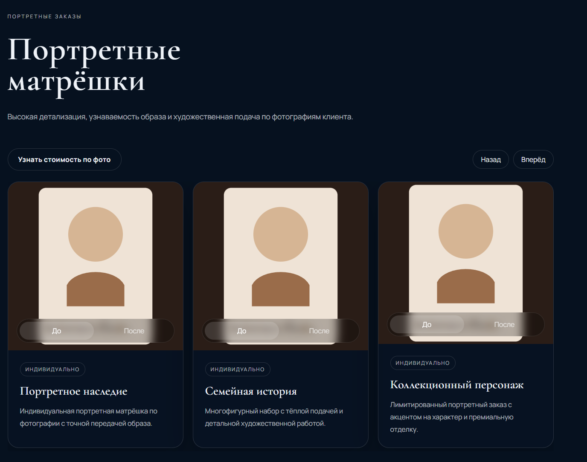
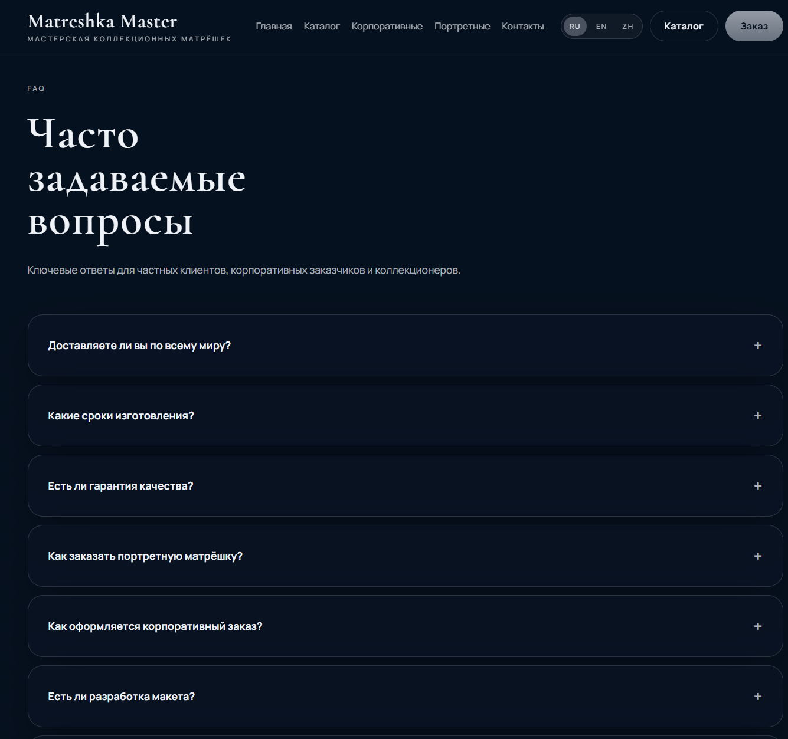
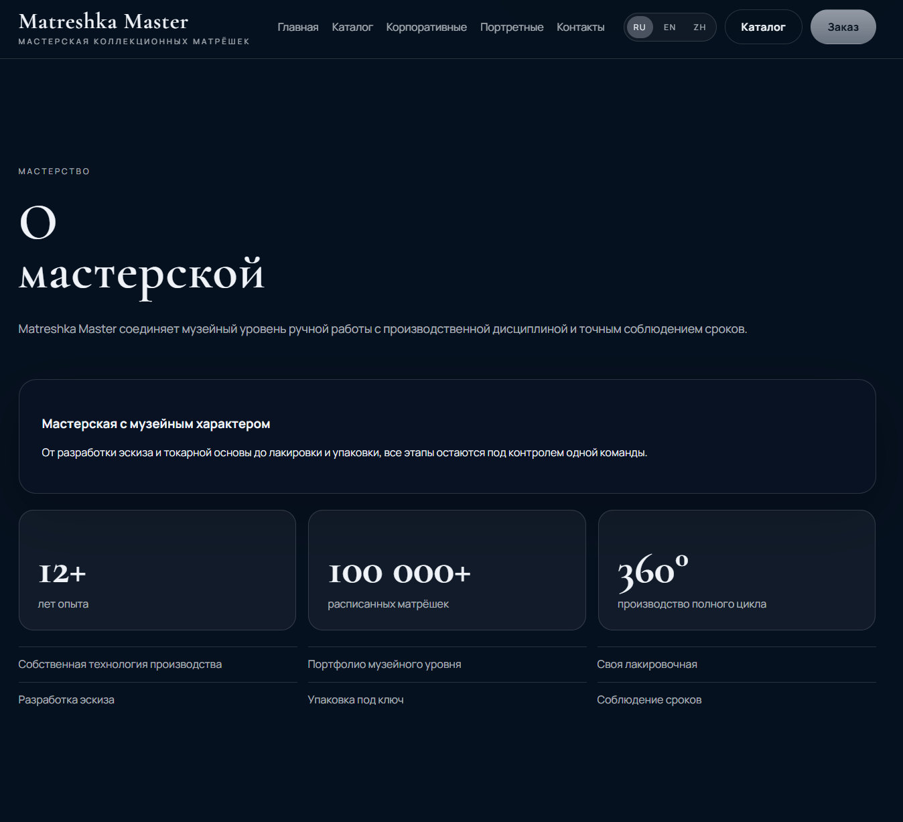
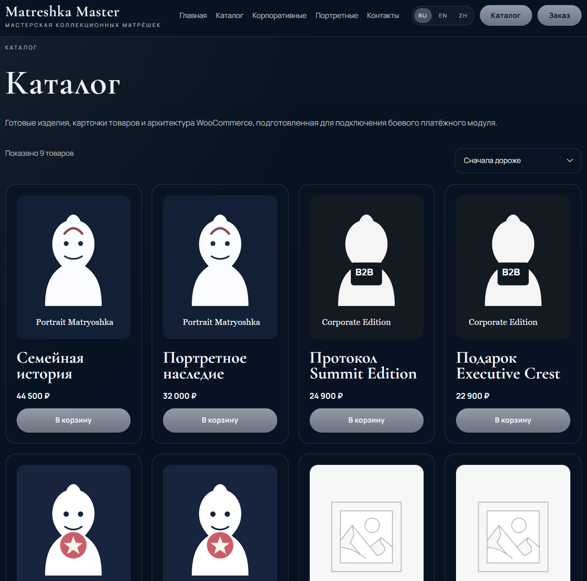
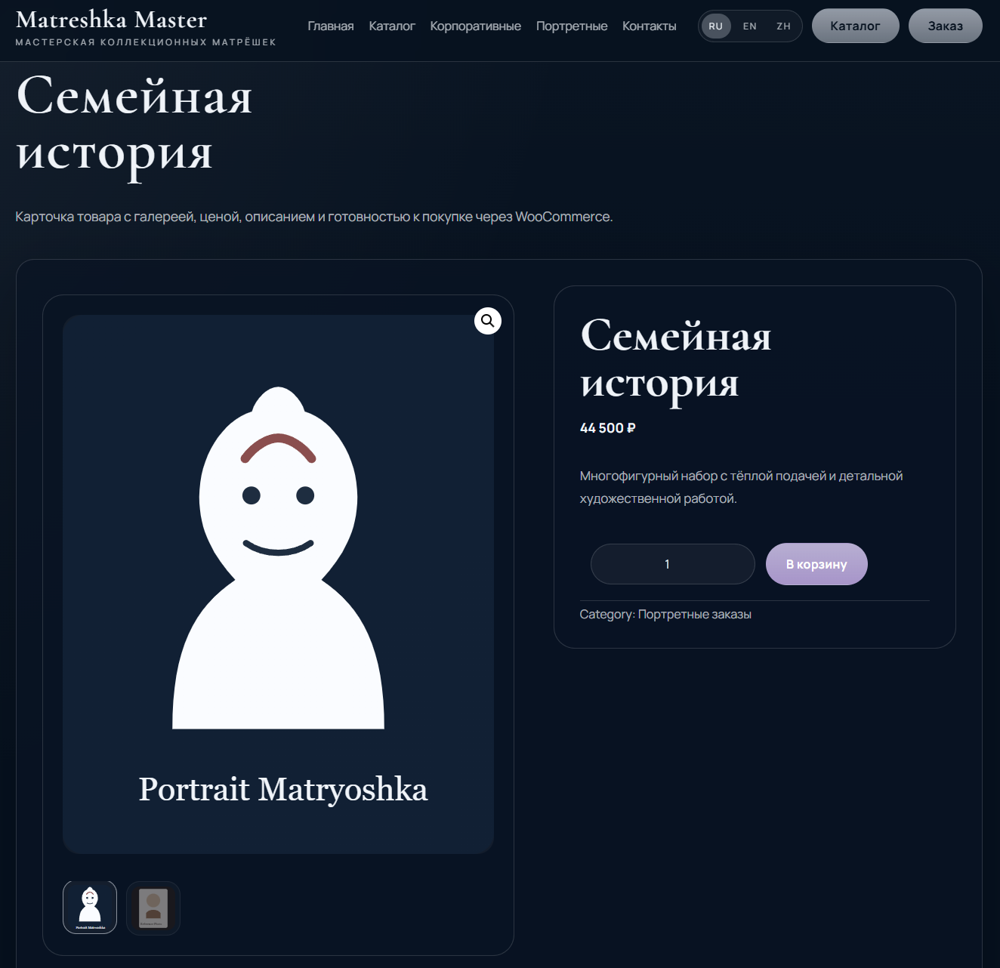
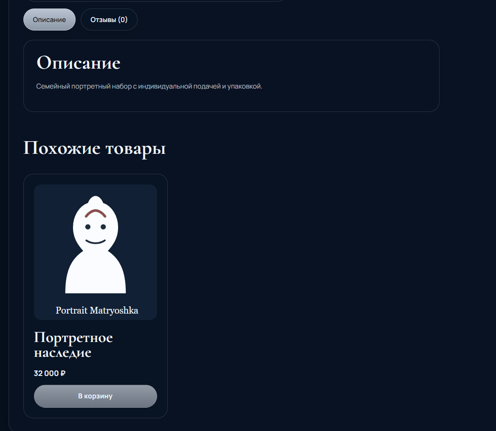
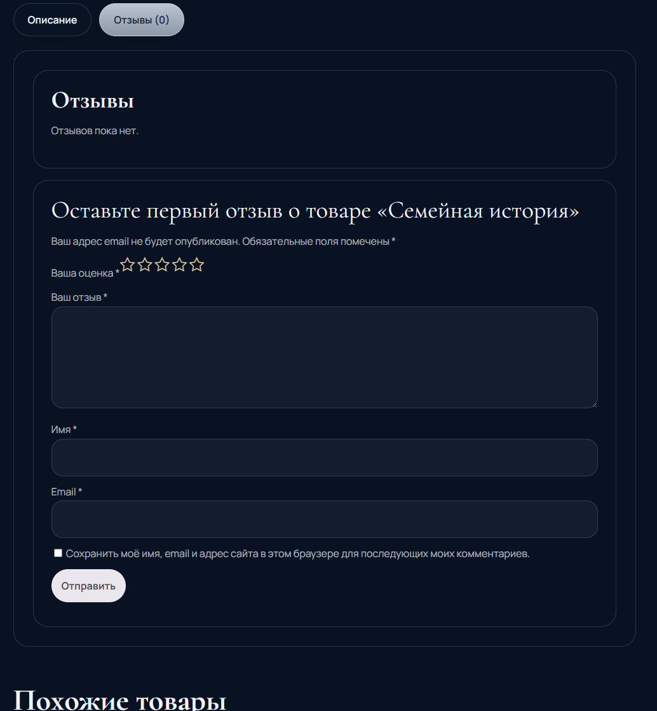

<div align="center">

# Matreshka Master
### Премиальный WordPress / WooCommerce сайт-каталог для бренда коллекционных матрёшек

Кастомный WordPress-проект с premium UI, WooCommerce-каталогом, редактируемой главной страницей, формами заявок и подготовленной архитектурой под мультиязычность.

---

[](https://github.com/DIBERLOG/matreshka-master-wordpress)
[](#-архитектура)
[](#-что-реализовано)
[](#-что-было-в-тз)
[](LICENSE)

</div>

---

## Обзор

`Matreshka Master` — это кастомный WordPress-сайт для мастерской коллекционных матрёшек. Проект задумывался как премиальный адаптивный каталог с акцентом на quiet luxury визуал, WooCommerce-архитектуру, понятную админку и подготовку под три языка: русский, английский и китайский.

В репозитории уже собраны:

- кастомная WordPress-тема
- кастомный проектный плагин
- главная страница по структуре ТЗ
- WooCommerce-каталог с демо-товарами
- редактируемые секции через админку
- формы заявок и сохранение лидов
- локальный Docker-стенд
- документация по запуску и редактированию

## Что было в ТЗ

Исходное задание требовало:

- премиальный адаптивный сайт компании «Матрёшка Мастер»
- WordPress как CMS
- WooCommerce для каталога и онлайн-оплаты
- каталог примерно на 100 товаров
- quiet luxury визуальный стиль
- главную страницу из нескольких витрин и продающих секций
- формы заявок для частных и B2B-клиентов
- мультиязычность: `RU / EN / ZH`
- удобную админку без зависимости от разработчика
- SEO-friendly структуру
- готовность к дальнейшей доработке другим разработчиком

---

## Что реализовано

### Frontend

- премиальная главная страница в тёмной luxury-палитре
- hero-блок с CTA и редактируемым контентом
- витрина готовых изделий
- витрина корпоративных подарков
- витрина портретных заказов
- блок «Для элиты»
- блок о мастерской со статистикой и преимуществами
- FAQ-аккордеон
- форма захвата и CTA-переходы
- адаптивная шапка, меню и мобильная версия

### Catalog / WooCommerce

- страница магазина с кастомной темизацией
- демо-каталог товаров
- русифицированные названия и цены в рублях
- кастомный внешний вид карточек каталога
- оформленная страница товара
- стилизованные вкладки «Описание / Отзывы»

### WordPress Admin

- редактируемая главная через метабоксы
- отдельный раздел витрин
- отдельный раздел FAQ
- раздел заявок
- глобальные настройки проекта
- базовая архитектура для мультиязычности

### Интеграции и архитектура

- WooCommerce как база каталога и оплаты
- подготовка к SMTP, Bitrix, Telegram, WhatsApp и MAX
- lead storage в админке
- локальный bootstrap через Docker + WP-CLI

---

## Что пока зависит от продакшена

Сейчас репозиторий уже годится как сильная рабочая база и demo-case, но для финального production-запуска всё ещё нужны:

- реальные фото и видео
- финальные тексты на `RU / EN / ZH`
- юридические страницы и реквизиты
- боевой SMTP
- платёжный модуль
- реальные доступы к Bitrix / Telegram / WhatsApp / MAX
- финальное решение по мультиязычному WooCommerce-каталогу

Важно: для полноценного мультиязычного каталога WooCommerce нужен один из production-вариантов:

- `Polylang for WooCommerce`
- `WPML + WooCommerce Multilingual`

---

## Архитектура

Проект разбит на два основных слоя:

- `wp-content/themes/matreshka-master` — кастомная тема, шаблоны и стили
- `wp-content/plugins/matreshka-master-core` — проектный плагин с контентными сущностями, метабоксами и формами

Ключевые файлы:

- `wp-content/themes/matreshka-master/woocommerce.php`
- `wp-content/themes/matreshka-master/assets/css/main.css`
- `wp-content/themes/matreshka-master/inc/theme-setup.php`
- `wp-content/plugins/matreshka-master-core/includes/class-mm-admin.php`
- `wp-content/plugins/matreshka-master-core/includes/class-mm-forms.php`
- `wp-content/plugins/matreshka-master-core/includes/class-mm-content.php`

---

## Стек

| Слой | Решение |
| --- | --- |
| CMS | WordPress |
| Каталог | WooCommerce |
| Тема | Custom PHP Theme |
| Проектная логика | Custom Plugin |
| Frontend | HTML, CSS, Vanilla JS |
| Мультиязычная архитектура | Polylang-ready / WPML-ready |
| Локальная среда | Docker, MySQL, WP-CLI |
| SEO-слой | Rank Math-ready foundation |

---

## Структура репозитория

```text
.
|- docker-compose.yml
|- README.md
|- LICENSE
|- docs/
|  |- architecture.md
|  |- content-editing.md
|  |- deployment.md
|  |- plugin-inventory.md
|  `- screenshots/
|- scripts/
|  |- bootstrap.ps1
|  |- seed-demo.php
|  `- wp.ps1
`- wp-content/
   |- plugins/
   |  `- matreshka-master-core/
   `- themes/
      `- matreshka-master/
```

---

## Локальный запуск

```powershell
powershell -ExecutionPolicy Bypass -File .\scripts\bootstrap.ps1
```

После запуска:

- фронт: [http://localhost:8080](http://localhost:8080)
- админка: [http://localhost:8080/wp-admin](http://localhost:8080/wp-admin)

Локальные учётные данные по умолчанию:

- логин: `admin`
- пароль: `admin`

---

## Документация

- [Архитектура](docs/architecture.md)
- [Редактирование контента](docs/content-editing.md)
- [Развёртывание](docs/deployment.md)
- [Плагины и зависимости](docs/plugin-inventory.md)

---

## Лицензия

Репозиторий опубликован по кастомной лицензии `DIBERLOG Portfolio License`.

Использование кода и материалов разрешено только для просмотра, оценки и портфолио-демонстрации. Любое копирование, коммерческое использование, переработка и переиспользование без письменного разрешения автора запрещены.

См. файл [LICENSE](LICENSE).

---

## Галерея

### Hero


### Витрина: матрёшки с принтами


### Витрина: корпоративные подарки


### Витрина: портретные матрёшки


### FAQ


### Блок о мастерской


### Каталог


### Карточка товара


### Вкладки товара


### Отзывы и форма

